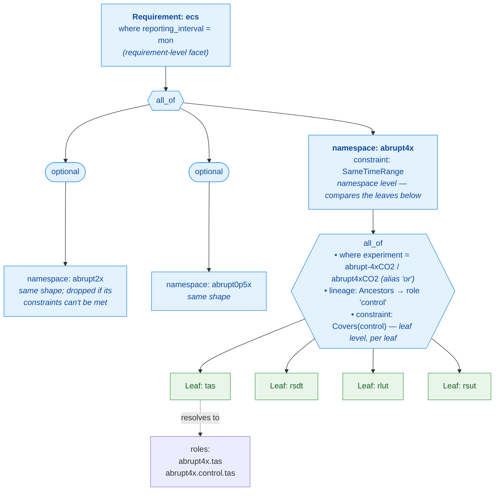
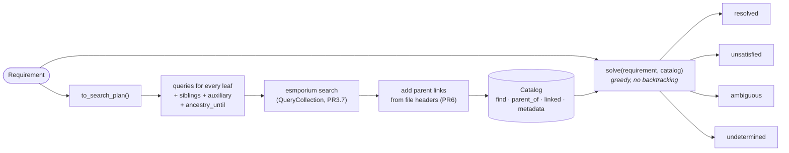

# Expressing analysis data requirements

Design note for the requirements system in `src/esmporium/requirements/`. It lands
ahead of the implementation (R0 in the *Requirements (R0–R12)* section of `PLAN.md`)
so that every later PR can be read against a stated target.

Written: 2026-09-14.
Updated: 2026-09-24

## Three kinds of "or"

| Kind | Example | Expressed as |
|---|---|---|
| Alias | `abrupt-4xCO2` / `abrupt4xCO2`, `fLuc` / `fLUC` | Tuple facet values in `Query` |
| Fan-out | Any of the piClim experiments, each analysed separately | `group_by` includes the facet |
| Alternative | `sfcWind` or (`uas` and `vas`) | `any_of(...)`: first that can be satisfied wins |

Most "or"s in the use cases are fan-outs.

## The tree

A requirement is a **tree**: one root node at the top branching downward to *leaves*
at the tips (drawn upside down, like a family tree). Two general terms recur
throughout this note:

- a **leaf** is a node with nothing below it — the end of a branch;
- an **internal node** has children and exists to group or wrap them.

The nesting is the point. A calculation's data needs are naturally "all of these,
and optionally those, or else that one", and a tree is what expresses that shape:

```text
Requirement                 ← root (an internal node; always has one child)
   └── all_of               ← internal node: needs ALL of its children
       ├── Leaf: tas        ← leaf: one dataset, nothing below it
       ├── Leaf: rsdt       ← leaf
       └── namespace        ← internal node: wraps a child, renames its leaves
           └── ...
```

The building blocks, from the tips up. Note the capitalisation: **`Leaf` (capital L)
is a class — the one kind of leaf node; lower-case "leaf" is the general position at
a tip of the tree.** Everything below `Leaf.of` builds an *internal* node, not a leaf:

- **`Leaf.of(query, role=, aux=, lineage=, constraints=)`** — builds a **leaf**, one
  dataset per group, because a leaf carries everything about one dataset and that is
  where the work happens. (`.of(...)` is a factory: a function that hands back a
  `Leaf`; it takes a query, never other nodes.) A bare string means `Query(variable=...)`. A facet with several values is an OR, exactly as in esmporium, so `variable=("fLuc", "fLUC")` takes either. The role says what the dataset is *for*, which is why pattern scaling's nine variables sit in one leaf called `field`, with the variable itself in the group key.
- **`all_of`, `any_of` (ordered) and `optional`** — build **internal nodes, not
  leaves**: each holds child nodes (leaves, or other internal nodes) and says how to
  combine them. `all_of` needs every child; `any_of` takes the first child that can be
  satisfied; `optional` includes its child when the child's own constraints are met,
  otherwise it is absent. They take *nodes* as arguments, whereas `Leaf.of` takes a
  *query* — the quickest way to tell a container from a leaf.
- **`namespace(name, child, constraints=)`** — an internal node that prefixes roles, so the same role can appear twice (`abrupt4x.tas` and `abrupt2x.tas`), and holds checks which compare leaves.
- **`Requirement(tree, name=, where=, group_by=, prefer=, cardinality=, constraints=)`** — the root.

Every node has the same three ways to say something about the leaves below it, and each pushes down to the leaves:

| Helper | Sets | Contradiction |
|---|---|---|
| `.where(**facets)` | facets on each leaf's query | raises `ConflictingFacetsError` |
| `.with_lineage(relation)` | how each leaf finds its control | replaces |
| `.with_constraints(*checks)` | checks on each leaf, one leaf at a time | adds |

`Requirement.where` does the same thing for the whole tree, and raises the same
error when a leaf already sets a facet differently: **set each facet once.**

There is deliberately no node for "one experiment": that was four separable
things in a trench coat (shared facets, a lineage, scoped checks and a role
prefix), and each now has one home.

Resolved roles look like `tas`, `control.tas`, `chain.0.tas`, `nbp.sftlf`
and, inside a namespace, `abrupt4x.control.tas`.

The diagram below draws one concrete requirement: equilibrium climate sensitivity
(ECS) — temperature and top-of-atmosphere radiation from the abrupt-4xCO2
experiment (optionally also 2x and 0.5x), each traced back to its piControl, which
must cover it. It shows the two things that are easy to miss in prose: the three
levels a check attaches at (leaf, namespace, requirement), and how role names gain
their prefixes as they resolve. **Leaves are green; every other node is an internal
node (blue) that groups or wraps them** — `all_of` needs all its children, `optional`
may drop its child, and a `namespace` renames the leaves below it.



## Relations

`group_by` applies to the datasets a leaf selects. Everything else hangs off one of those:

- **`Ancestors(until=..., role=...)`** walks parent links, which come from file headers (esmporium PR6). `until` is a query, so `("piControl", "esm-piControl")` works. `role` is **required**, names the dataset it stops at, and is what constraints refer to: write `role="control"` when walking back to piControl, `role="historical"` when that is where you stop.
- **`Sibling(query, match_on=..., role=...)`** matches facets instead. piClim-histall and piClim-control are both children of piControl, so ERF needs this.
- **`Aux(query, required=, match=, via=, also_for_lineage=)`** is auxiliary data, **named explicitly** by the user: sftlf for land variables, sftof for ocean ones, and areacella, areacello or areacellr. There is no built-in mapping.
  - `via="match"` (the default) compares facets level by level. The default is a **single strict level** (model, grid, experiment, variant), so fallbacks are opt-in: see `FX_FALLBACK` in the use cases.
  - `via="link"` follows dataset-to-dataset links. **This is where all of it should end up:** esmporium links at ingestion, once, so every analysis reads the same answer instead of redoing the matching. `match` stays as the fallback for whatever is not linked yet, and should be rare.
  - `also_for_lineage` (True by default) says whether the control needs the auxiliary data too.

Proposed esmporium work: create those links from each file's **`cell_measures`** attribute only, e.g. tas → areacella.
`cell_methods` names an area type, not a variable, so it isn't used.
Picking *which* areacella dataset to link is also strict by default, with fallbacks opt-in and recorded on the link.

## Constraints

A `Constraint` declares the metadata it needs and returns `Pass`, `Degraded(msg)` or `Fail(msg)`.

**Where a check goes decides what happens when it fails**, which is the point of
attaching them at three levels:

- **On a leaf** (most checks): it sees that dataset and its lineage. A failure
  fails that leaf, so an `optional` part around it is simply dropped.
- **On a namespace**: it sees everything inside. This is the home for checks
  which compare leaves.
- **On the requirement**: it sees the whole group.

Shipped checks:

- **`Covers(role, target, align="branch" | "calendar", pad_years=, ideal_pad_years=)`** — e.g. the control covers the dataset's span, mapped through branch times along the whole chain. `pad_years=None` makes it soft. `role` and `target` name datasets **as the lineage names them**, which is why a lineage's `role` is required: `Covers(role="control")` and `Ancestors(role="control")` are visibly the same thing. `"self"` is the anchor, `"chain.<i>"` an intermediate parent, `"end"` works without knowing the name.
- **`SameTimeRange(roles)`** — a cross-leaf check: a Gregory regression uses temperature and radiation together, so ECS puts this on its namespace. Identical periods pass, overlapping ones degrade (naming the overlap), disjoint ones fail.

**Serialisation:** constraints are stored with their import path, so they must be pydantic models to serialise.

## Solving

`solve(requirement, catalog)` is greedy, with no backtracking.

- **Groups** are the union of `group_by` values over every leaf's candidates.
- **Leaves** apply `prefer`, then resolve their lineage, auxiliary data and own checks. If several candidates remain, the group is `ambiguous`.
- **Ambiguous and undetermined results are never skipped**: `any_of` stops at them, and `optional` passes them on.
- **Output:** resolved, unsatisfied, ambiguous and undetermined groups, each with an explanation tree (`SolveResult.explain()`). Per node, `Resolved` and `Unresolved` carry the roles, lineages, choices and notes that are merged upwards.

`Catalog` is a protocol with `find`, `parent_of`, `linked` and `metadata`.
`InMemoryCatalog` stands in until esmporium has parent links and file information.

## Flow and storage

1. `to_search_plan(requirement)` returns queries for every leaf (including optional ones and every alternative), sibling queries and auxiliary queries. Leaves that differ only in variable are merged, which `merge_variables=False` turns off. It also returns `ancestry_until`.
2. esmporium searches (`QueryCollection`, PR3.7), then adds parent links (PR6).
3. `solve`.



A `QueryCollection` that is a plain union is enough.
"Requirement became satisfiable" is the difference between `solve` at t1 and at t2.
Storing requirements (their canonical JSON and hash) and solve snapshots only matters for that comparison.
Once requirements are in esmporium, those are ordinary esmporium tables.

## Queries and facets

`set_facets` flattens a query, including `other_terms`, because that is esmporium's
escape hatch for facets a query class does not name.
Naming the same facet twice raises `ClashingFacetError`.

**Project-specific facets are supported, and esmporium decides how.**
Answering a query which names CMIP5's `product` is `Catalog.find`'s business, and
nothing here needs to know how it is done. The one thing selection needs is that
grouping, `prefer` and auxiliary matching compare *records*, so a catalog must put
any facet it wants used that way into each record's `extra`. Requirements therefore
accept any facet name, and a facet no record knows fails when solving, naming the
facet and the dataset.

## Findings worth remembering

These come from the CMIP6 CMOR tables and the CVs (read WCRP-universe, not CMIP7-CVs, for parents).

- **Fractions:** land carbon variables and nbp are `area: mean where land`, so they need sftlf. fgco2, hfds and siconc are `mean where sea`, with areacello, so they need sftof. fCLandToOcean uses areacellr.
- **Radiation:** there is no `rndt`, so radiation is rsdt, rlut and rsut. `rtmt` is top of *model*.
- **Parents:**
  - esm-bell-\* → esm-piControl.
  - esm-1pct-brch-\* → 1pctCO2 or esm-1pctCO2.
  - esm-flat10 → esm-piControl; esm-flat10-zec and -cdr → esm-flat10, at the end of year 100.
  - piClim-control and piClim-histall → piControl.
- **Case:** CMIP7 CV IDs are lower-case. Check whether ESGF facet values are too.
