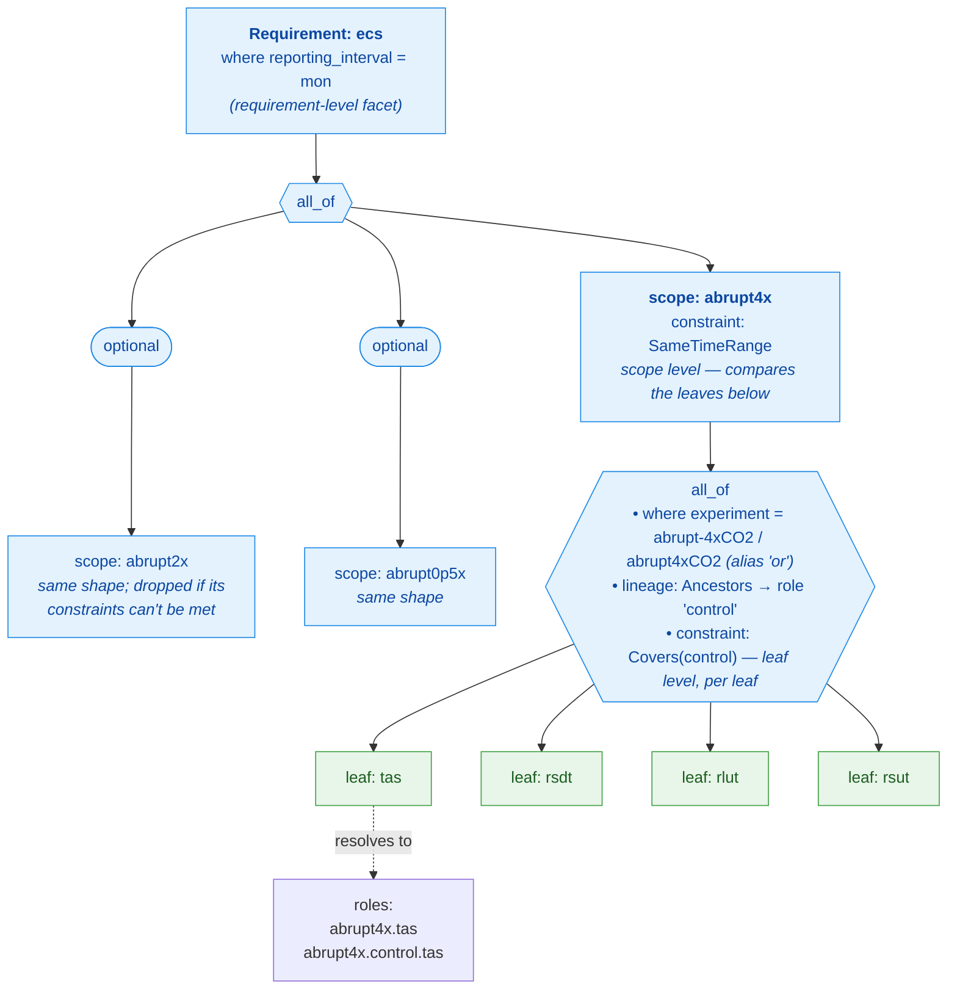
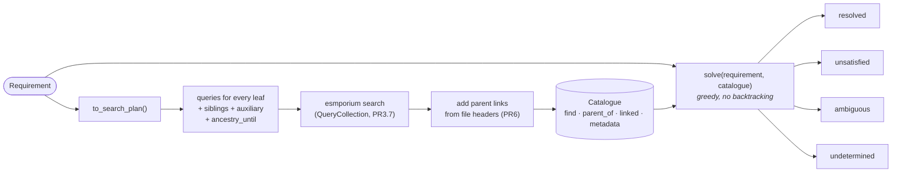

# Expressing analysis data requirements

Design note for the requirements system in `src/esmporium/requirements/`. It lands
ahead of the implementation (R0 in the *Requirements (R0–R12)* section of `PLAN.md`)
so that every later PR can be read against a stated target.

Written: 2026-09-14.
Updated: 2026-09-30

## Three kinds of "or"

| Kind | Example | Expressed as |
|---|---|---|
| Alias | `abrupt-4xCO2` / `abrupt4xCO2`, `fLuc` / `fLUC` | Tuple facet values in `Query` |
| Fan-out | Any of the piClim experiments, each analysed separately | `group_by` includes the facet |
| Alternative | `sfcWind` or (`uas` and `vas`) | `any_of(...)`: first that can be satisfied wins |

Most "or"s in the use cases are fan-outs.

## Groups

A requirement is solved **once per group**, and a group is one run of the analysis:
ECS across forty models is forty groups, each resolved and reported on its own.

`group_by` on the `Requirement` names the facets to split on, so `group_by=("model",)`
gives one group per model. The groups are not listed up front. They are discovered
from what the search found — the distinct combinations of those facet values across
every leaf's candidates — so if twelve models published the variables you asked for,
you get twelve groups.

```text
group_by = ("model",)

  the tree                          the groups
  (written once)                    (discovered from the candidates)

      all_of                        ┌── CanESM5      ─┐
      /  |  \                       ├── MPI-ESM-LR   ─┤   the tree is solved
   tas  rsdt rlut                   └── ACCESS-CM2   ─┘   once for each
```

This is the difference between data an analysis needs *together* and data it repeats
*over*. Datasets needed together are separate leaves: ECS wants tas, rsdt, rlut and
rsut in the same run, so it has four. A facet the analysis simply repeats over goes
in `group_by` instead: pattern scaling's nine variables are nine separate runs, so
they are one leaf with `variable` in the group key, not nine leaves.

Within a group, a leaf resolves to **exactly one** dataset. Several surviving
candidates make the group `ambiguous`, none makes it `unsatisfied`, and every group
is judged on its own — one model can resolve while the next does not.

(That is `cardinality="one"`, the default. `cardinality="all"` is for an analysis
whose subject *is* the spread across candidates — see
[Which one gets picked](#which-one-gets-picked).)

## The tree

A requirement is a **tree**: one root node at the top branching downward to *leaves*
at the tips (drawn upside down, like a family tree). Two general terms recur
throughout this note:

- a **leaf** is a node with nothing below it — the end of a branch;
- an **internal node** has children and exists to group or wrap them.

The nesting is the point. A calculation's data needs are naturally "all of these,
and optionally those, or else that one", and a tree is what expresses that shape:

```text
Requirement                 ← root (an internal node; always has one child)
   └── all_of               ← internal node: needs ALL of its children
       ├── leaf: tas        ← leaf: one dataset, nothing below it
       ├── leaf: rsdt       ← leaf
       └── scope            ← internal node: wraps a child, renames its leaves
           └── ...
```

The building blocks, from the tips up. The one rule to hold onto is what each of them
takes: **a leaf takes a query, everything else takes nodes.** That is the quickest way
to tell a leaf from a container.

A leaf is built with `leaf(query=..., role=...)`, naming both of its parts rather than
inferring either: a leaf is where every fact about a dataset ends up, and neither what
it asks for nor what it is called is worth guessing at. Internal nodes, which handle
some of the logic, such as `all_of` and `any_of` take any number of children, and
`scope` takes a name as well as a child.

- **`leaf(query=..., role=..., aux=, lineage=, constraints=)`** — exactly
  one dataset per [group](#groups), because a leaf carries everything about one
  dataset and that is where the work happens. A facet with several values is an OR, exactly as in esmporium, so `variable=("fLuc", "fLUC")` takes either. The role says what the dataset is *for*, which is why pattern scaling's nine variables sit in one leaf called `field`, with the variable itself in the group key. See [A role is not a variable](#a-role-is-not-a-variable) below.
- **`all_of`, `any_of` (ordered) and `optional`** — build **internal nodes, not
  leaves**: each holds child nodes (leaves, or other internal nodes) and says how to
  combine them. `all_of` needs every child; `any_of` takes the first child that can be
  satisfied; `optional` includes its child when the child's own constraints are met,
  otherwise it is absent. They take *nodes* as arguments, whereas a leaf takes a
  *query*.
- **`scope(name, child, constraints=)`** — an internal node that prefixes roles, so the same role can appear twice (`abrupt4x.tas` and `abrupt2x.tas`), and holds checks which compare leaves.
- **`requirement(tree=, name=, group_by=, where=, prefer=, cardinality=, constraints=)`** — the root.
  `tree`, `name` and `group_by` are required: a grouping decides what "one run" means, so it is
  stated rather than defaulted. Write `group_by=("model", "variant_label")` when that is what you want.

Every node has the same three ways to say something about the leaves below it, and each pushes down to the leaves:

| Helper | Sets | Contradiction |
|---|---|---|
| `.where(query)` | facets on each leaf's query | raises `ConflictingFacetsError` |
| `.with_lineage(relation)` | how each leaf finds its control | raises `ConflictingLineageError` |
| `.with_constraints(*checks)` | checks on each leaf, one leaf at a time | adds |

`.where()` takes a query, in any style, rather than keyword facets — for the same
reason a leaf does. A query can name any facet, including one only a project names,
so `.where(QueryCMIP5(product="output1"))` works; keywords could only have reached
the facets `Query` declares, which made CMIP5's `product` a facet a leaf could hold
but nothing above it could add.

`Requirement.where` does the same thing for the whole tree, and raises the same
error when a leaf already sets a facet differently: **set each facet once.**

There is deliberately no node for "one experiment": that was four separable
things in a trench coat (shared facets, a lineage, scoped checks and a role
prefix), and each now has one home.

Resolved roles look like `tas`, `control.tas`, `chain.0.tas`, `nbp.sftlf`
and, inside a scope, `abrupt4x.control.tas`.

### A role is not a variable

Most of the roles above read like variable names, and that is a coincidence of the
analyses which happen to be drawn here, not what a role is. It is worth pinning down,
because `variable` does two completely different jobs depending on where it is put,
and only one of them has anything to do with roles.

Pattern scaling is the clearest case. It scales *a* field against global mean
temperature, and there are nine candidate fields. It does not need nine datasets
together — it needs one at a time, nine times over. So it is **one leaf, with nine
variables in its query, and a role which is not a variable name at all**:

```text
leaf(
    query=Query(variable=("tas", "tasmax", "tasmin", "huss", "pr",
                          "sfcWind", "ps", "rsds", "rlds")),   ← an OR: any one of these
    role="field",                                              ← ONE slot, named for
)                                                                what it is FOR

group_by = ("model", "variant_label", "experiment", "variable")
                                                   └────┬───┘
                                                 variable SPLITS the analysis

  role paths: {"field"}          one slot, not nine

  and the tree is solved once per combination:
      CanESM5 / r1i1p1f1 / ssp126 / tas    → field = one dataset
      CanESM5 / r1i1p1f1 / ssp126 / pr     → field = one dataset
      CanESM5 / r1i1p1f1 / ssp245 / tas    → field = one dataset
      ...
```

The two homes of `variable`, side by side:

```text
   variable in the LEAF'S QUERY          variable in GROUP_BY
   ────────────────────────────          ────────────────────
   "any of these will do"                "run the whole analysis
   pick ONE per group                     once per value"
   → one dataset                         → many runs
```

ECS is the other case, and the reason roles so often *look* like variables. It needs
tas, rsdt, rlut and rsut **in the same run**, to regress one against the others — four
different datasets, so four leaves. Naming each role after its variable is then simply
the clearest thing to call it. That is a fact about ECS, not a rule about leaves.

The test to apply: if the analysis wants these datasets *together*, they are separate
leaves; if it repeats *over* them, they are one leaf and a `group_by` entry.

#### Which one gets picked

"Any of these will do" still has to end in one dataset, so when a leaf's query lists
several values and the search finds more than one of them in a group, something has to
choose. Two settings on the `Requirement` do it, in this order:

1. **`prefer`** decides. It is a mapping of facet to values in order of preference,
   `prefer={"variable": ("sfcWind", "uas")}`, and the earliest value listed wins. It is
   not special to `variable` — `prefer={"grid_label": ("gn", "gr")}` breaks the same
   kind of tie on any facet, project-specific ones included.
2. **`cardinality`** says what happens if a tie *survives* `prefer` — because no
   `prefer` entry covers the facet they differ on, or because they are equal on it.
   `"one"` (the default) makes the group **ambiguous**; `"all"` keeps every remaining
   candidate.

```text
   group: CanESM5 / r1i1p1f1 / ssp126
   leaf query: variable = ("sfcWind", "uas", "vas")   ← any of these will do

   found in this group        prefer = {"variable": ("uas", "sfcWind")}
   ──────────────────         ────────────────────────────────────────
     sfcWind  ─┐
     uas      ─┼──► prefer ──►  uas is listed first
     vas      ─┘                → uas, and the group RESOLVES

                              no prefer entry for variable
                              ────────────────────────────
     sfcWind  ─┐                cardinality = "one"  → AMBIGUOUS
     uas      ─┼──►  tie   ──►                         (nothing is picked)
     vas      ─┘                cardinality = "all"  → all three are kept
```

The important half of that is the second one: **ambiguity is an outcome, not a pick.**
A group is never resolved by guessing, and an ambiguous group is reported rather than
quietly dropped, so the fix is yours to make — add a `prefer` entry, narrow the leaf's
query, or move the facet into `group_by` so the values stop competing.

Which is the case that does not arise: with `variable` in `group_by`, as in pattern
scaling above, several variables never tie, because each one is a group of its own.

Still to decide, and it needs the solver to be real before it is worth settling: what
happens when two `prefer` entries disagree, one facet favouring one candidate and
another facet favouring the other. `prefer` is written as a mapping, whose order is
deliberately not part of the requirement's hash, so it does not currently say which
facet outranks which.

#### One requirement, drawn in full

The diagram below draws one concrete requirement: equilibrium climate sensitivity
(ECS) — temperature and top-of-atmosphere radiation from the abrupt-4xCO2
experiment (optionally also 2x and 0.5x), each traced back to its piControl, which
must cover it. It shows the two things that are easy to miss in prose: the three
levels a check attaches at (leaf, scope, requirement), and how role names gain
their prefixes as they resolve. **Leaves are green; every other node is an internal
node (blue) that groups or wraps them** — `all_of` needs all its children, `optional`
may drop its child, and a `scope` renames the leaves below it.


```mermaid
flowchart TD
    R["<b>Requirement: ecs</b><br/>where reporting_interval = mon<br/><i>(requirement-level facet)</i>"]
    R --> A{{all_of}}
    A --> NS4["<b>scope: abrupt4x</b><br/>constraint: SameTimeRange<br/><i>scope level — compares the leaves below</i>"]
    A --> O2(["optional"])
    A --> O05(["optional"])
    O2 --> NS2["scope: abrupt2x<br/><i>same shape; dropped if its<br/>constraints can't be met</i>"]
    O05 --> NS05["scope: abrupt0p5x<br/><i>same shape</i>"]
    NS4 --> A4{{"all_of<br/>• where experiment = abrupt-4xCO2 / abrupt4xCO2 <i>(alias 'or')</i><br/>• lineage: Ancestors → role 'control'<br/>• constraint: Covers(control) — <i>leaf level, per leaf</i>"}}
    A4 --> T["leaf: tas"]
    A4 --> D["leaf: rsdt"]
    A4 --> L["leaf: rlut"]
    A4 --> S["leaf: rsut"]
    T -.->|resolves to| RP["roles:<br/>abrupt4x.tas<br/>abrupt4x.control.tas"]

    classDef leaf fill:#e8f5e9,stroke:#43a047,color:#1b5e20;
    classDef internal fill:#e3f2fd,stroke:#1e88e5,color:#0d47a1;
    class T,D,L,S leaf;
    class R,A,NS4,O2,O05,NS2,NS05,A4 internal;
```

## Relations

`group_by` applies to the datasets a leaf selects. Everything else hangs off one of those:

- **`Ancestors(until=..., role=...)`** walks parent links, which come from file headers (esmporium PR6). `until` is a query (noting also that until only relates to the experiments facet), so `("piControl", "esm-piControl")` works. `role` is **required**, names the dataset it stops at, and is what constraints refer to: e.g. write `role="piControl"` when walking back to piControl, `role="historical"` when that is where you stop. The experiment (facet) value should be written correctly. No hardcoding of where to stop, that is the user's role.
- **`Sibling(query, match_on=..., role=...)`** matches facets instead. piClim-histall and piClim-control are both children of piControl, so ERF needs this.
- **`Aux(query, required=, match=, via=, also_for_lineage=)`** is auxiliary data, **named explicitly** by the user: sftlf for land variables, sftof for ocean ones, and areacella, areacello or areacellr. There is no built-in mapping.
  - `via="match"` (the default) compares facets level by level. The default is a **single strict level** (model, grid, experiment, variant), so fallbacks are opt-in: see `FX_FALLBACK` in the use cases.
  - `via="link"` follows dataset-to-dataset links. **This is where all of it should end up:** esmporium links at ingestion, once, so every analysis reads the same answer instead of redoing the matching. `match` stays as the fallback for whatever is not linked yet, and should be rare.
  - `also_for_lineage` (True by default) says whether the control needs the auxiliary data too.

Proposed esmporium work: create those links from each file's **`cell_measures`** attribute only, e.g. tas → areacella.
`cell_methods` names an area type, not a variable, so it isn't used.
Picking *which* areacella dataset to link is also strict by default, with fallbacks opt-in and recorded on the link.

## Constraints

A `Constraint` declares the metadata it needs and returns `Pass`, `Degraded(msg)` or `Fail(msg)`.

**Where a check goes decides what happens when it fails**, which is the point of
attaching them at three levels:

- **On a leaf** (most checks): it sees that dataset and its lineage. A failure
  fails that leaf, so an `optional` part around it is simply dropped.
- **On a scope**: it sees everything inside. This is the home for checks
  which compare leaves.
- **On the requirement**: it sees the whole group.

Shipped checks:

- **`Covers(role, target, align="branch" | "calendar", pad_years=, ideal_pad_years=)`** — e.g. the control covers the dataset's span, mapped through branch times along the whole chain. `pad_years=None` makes it soft. `role` and `target` name datasets **as the lineage names them**, which is why a lineage's `role` is required: `Covers(role="control")` and `Ancestors(role="control")` are visibly the same thing. `"self"` is the anchor, `"chain.<i>"` an intermediate parent, `"end"` works without knowing the name.
- **`SameTimeRange(roles)`** — a cross-leaf check: a Gregory regression uses temperature and radiation together, so ECS puts this on its scope. Identical periods pass, overlapping ones degrade (naming the overlap), disjoint ones fail.

**Serialisation:** constraints are stored with their import path, so they must be pydantic models to serialise.

## Solving

`solve(requirement, catalogue)` is greedy, with no backtracking. This choice means that we need to give clear error messages, to help users be able to spot places where there might be solutions that they could try. The setup below should also keep the door open to doing non-greedy solving too, but we are not implementing that now as we think that the cost of non-greedy search is not worth the benefit (which we expect to be very small). We will re-evaluate that once we start working with real data.

- **Groups** are the union of `group_by` values over every leaf's candidates.
- **Leaves** apply `prefer`, then resolve their lineage, auxiliary data and own checks. If several candidates remain, the group is `ambiguous`.
- **Ambiguous and undetermined results are never skipped**: `any_of` stops at them, and `optional` passes them on.
- **Output:** resolved, unsatisfied, ambiguous and undetermined groups, each with an explanation tree (`SolveResult.explain()`). Per node, `Resolved` and `Unresolved` carry the roles, lineages, choices and notes that are merged upwards.

`Catalogue` is a protocol with `find`, `parent_of`, `linked` and `metadata`.
`InMemoryCatalogue` stands in until esmporium has parent links and file information.

## Flow and storage

1. `to_search_plan(requirement)` returns queries for every leaf (including optional ones and every alternative), sibling queries and auxiliary queries. Leaves that differ only in variable are merged, which `merge_variables=False` turns off. It also returns `ancestry_until`.
2. esmporium searches (`QueryCollection`, PR3.7), then adds parent links (PR6).
3. `solve`.


```mermaid
flowchart LR
    REQ([Requirement]) --> SP["to_search_plan()"]
    SP --> Q["queries for every leaf<br/>+ siblings + auxiliary<br/>+ ancestry_until"]
    Q --> SEARCH["esmporium search<br/>(QueryCollection, PR3.7)"]
    SEARCH --> LINK["add parent links<br/>from file headers (PR6)"]
    LINK --> CAT[("Catalogue<br/>find · parent_of · linked · metadata")]
    REQ --> SOLVE["solve(requirement, catalogue)<br/><i>greedy, no backtracking</i>"]
    CAT --> SOLVE
    SOLVE --> RES["resolved"]
    SOLVE --> UNS["unsatisfied"]
    SOLVE --> AMB["ambiguous"]
    SOLVE --> UND["undetermined"]
```

### Which way the dependency runs

`search` will import `requirements`, never the other way round.

Step 2 above is the reason: `search` is going to take `Requirement` objects (PR3.7),
so it has to import them. That fixes the direction of the dependency for good, and
makes the reverse an error rather than a preference — `requirements` importing
`search` is a circular import, and both packages then fail to import at all with
*"cannot import name ... from partially initialized module"*.

This is worth stating plainly because the pull to do it is real. `search` and
`requirements` ask overlapping questions, so they want the same vocabulary, and the
obvious move when you find something defined twice is to import it from wherever it
already lives. Do not.

**When both need the same thing, it goes in `esmporium.query`.** Both already depend
on it, so neither has to depend on the other. `ClashingFacetsError` is the worked
example: a query naming one facet twice is ambiguous whether you are about to send it
to an API or match it against stored datasets, so it was defined twice, once in each
package. It now lives in `esmporium.query` and both import it from there. It is still
importable from `esmporium.search` for anyone who was already doing that.

What `requirements` may import from esmporium, then, is `esmporium.query`,
`DATASET_FACET_COLUMNS` from `esmporium.db.schema`, and `esmporium.formatting` for the
helpers which render error messages — which is the whole surface every
remaining piece of this design needs. The `esmporium.db` side will grow when the
database-backed catalogue lands, since that needs a session and the `Dataset` table.
The `esmporium.search` side will not. There is a test which checks both.

`esmporium.formatting` is a safe third entry because it depends on nothing but the
standard library, so it cannot be half of a cycle. That is the test to apply to
anything else proposed for this list: not "is it useful here?" but "could importing it
ever point back this way?". If it is useful and importing it could point back this way, then maybe we have to move it.

A `QueryCollection` that is a plain union is enough.
"Requirement became satisfiable" is the difference between `solve` at t1 and at t2.
Storing requirements (their canonical JSON and hash) and solve snapshots only matters for that comparison.
Once requirements are in esmporium, those are ordinary esmporium tables.

## Queries and facets

`set_facets` flattens a query, including `other_terms`, because that is esmporium's
escape hatch for facets a query class does not name.
Naming the same facet twice raises `ClashingFacetsError`.

**A leaf's query may be written in any style** — `Query`, `QueryCMIP5`, `QueryCMIP6`,
`QueryCMIP7` — and is translated on the way in, then stored as a `QueryCanonical`.
Three things need that single stored form: a stored requirement has to reload into a
known class, one question has to hash the same whichever style it was written in, and
`to_search_plan` converts *from* canonical when it turns a requirement back into
searches. So what a leaf gives back is not the object that went in, which is worth
knowing before comparing the two with `==`.

Translation normalises the *style*; it does not move facets about. Each one keeps its
home, and there are three:

| Home | Holds | Example |
|---|---|---|
| a declared field | the facets esmporium models | `variable`, `experiment` |
| `query_specific_facets` | facets a query style names, with no canonical name | CMIP5's `product` |
| `other_terms` | facets esmporium does not model at all | `variable_long_name` |

This is why `other_terms` stays a genuine escape hatch: a facet written there stays
there, even one we do model. The consequence is that home is part of the question, so
moving a facet between homes changes the requirement's hash, whereas rewriting it in
another query style does not. In general, `other_terms` should be used only if absolutely needed because of quirks like this.

**Project-specific facets are supported, and esmporium decides how.**
Answering a query which names CMIP5's `product` is `Catalogue.find`'s business, and
nothing here needs to know how it is done. The requirement's side of it is only to
keep the facet where it was written, which `query_specific_facets` above is for. The one thing the solver needs is that
grouping, `prefer` and auxiliary matching compare *entries*, so a catalogue must put
any facet it wants used that way into each entry's `extra`. Requirements therefore
accept any facet name, and a facet no entry knows fails when solving, naming the
facet and the dataset.

## Findings worth remembering

These come from the CMIP6 CMOR tables and the CVs (read WCRP-universe, not CMIP7-CVs, for parents).

- **Fractions:** land carbon variables and nbp are `area: mean where land`, so they need sftlf. fgco2, hfds and siconc are `mean where sea`, with areacello, so they need sftof. fCLandToOcean uses areacellr.
- **Radiation:** there is no `rndt`, so radiation is rsdt, rlut and rsut. `rtmt` is top of *model*.
- **Parents:** (Important here to note that for CMIP5 and CMIP6 data we have to look at file headers for parent information - although CMIP7 parent information is part of global attributes. For much of CMIP5 and some of CMIP6 parent information cannot be trusted, making ths search plan/execution much more difficult.)
  - esm-bell-\* → esm-piControl.
  - esm-1pct-brch-\* → 1pctCO2 or esm-1pctCO2.
  - esm-flat10 → esm-piControl; esm-flat10-zec and -cdr → esm-flat10, at the end of year 100.
  - piClim-control and piClim-histall → piControl.
- **Case:** CMIP7 CV IDs are lower-case. Check whether ESGF facet values are too.
